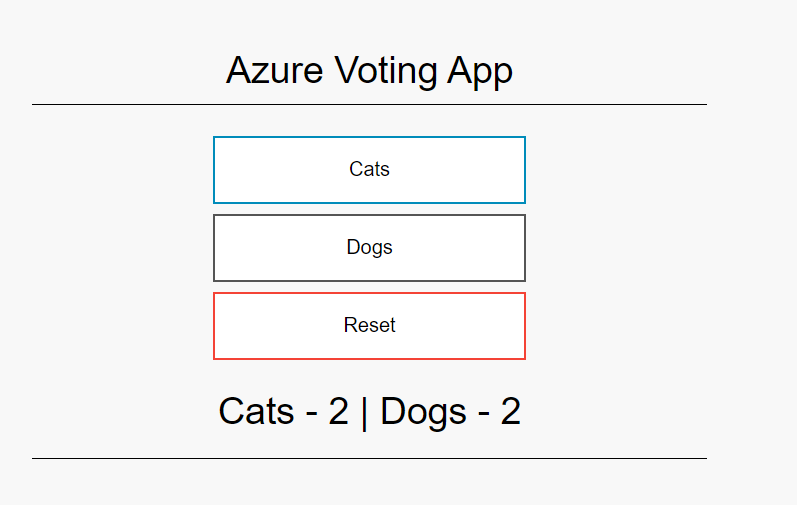

# Installing and Using the Azure Service Operator (ASO) V2 in Azure Red Hat OpenShift (ARO)

**Thatcher Hubbard**

The Azure Service Operator (ASO) provides Custom Resource Definitions (CRDs) for Azure resources that can be used to create, update, and delete Azure services from an OpenShift cluster.

> This example uses ASO V2, which is a replacement for ASO V1. Equivalent documentation for ASO V1 can be found [here](/azure-service-operator-v1). For new installs, V2 is recommended. MOBB has not tested running them in parallel.

## Prerequisites

* [Azure CLI](https://docs.microsoft.com/en-us/cli/azure/install-azure-cli?view=azure-cli-latest)
* [An Azure Red Hat OpenShift (ARO) cluster](/quickstart-aro)
* The `helm` CLI tool

## Prepare your Azure Account and ARO Cluster

1. Install `cert-manager`:

ASO relies on having the CRDs provided by [cert-manager](https://cert-manager.io) so it can request self-signed certificates. By default, cert-manager creates an `Issuer` of type `SelfSigned`, so it will work for ASO out-of-the-box. On an OpenShift cluster, the easiest way to do this is by using the OCP console, navigating to 'Operators | OperatorHub' and installing it from there; both the Red Hat certified and community versions will work. It's also possible to install by applying manifests directly as [covered here](https://docs.openshift.com/container-platform/4.10/operators/admin/olm-adding-operators-to-cluster.html#olm-installing-operator-from-operatorhub-using-cli_olm-adding-operators-to-a-cluster).

1. Set the following environment variables:

    > Note: modify the cluster name, region and resource group to match your cluster

    ```bash
AZURE_TENANT_ID=$(az account show -o tsv --query tenantId)
AZURE_SUBSCRIPTION_ID=$(az account show -o tsv --query id)
CLUSTER_NAME="test-cluster"
AZURE_RESOURCE_GROUP="test-rg"
AZURE_REGION="westus2"
    ```

1. Create a Service Principal with Contributor permissions to your subscription:

    > Note: You may want to lock this down to a specific resource group.

    ```bash
az ad sp create-for-rbac -n "$CLUSTER_NAME-aso" \
--role contributor --scopes /subscriptions/$AZURE_SUBSCRIPTION_ID
    ```

    The result should look something like this:

    ```json
    {
      "appId": "12f48391-31ac-4565-936a-8249232aeb18",
      "displayName": "test-cluster-aso",
      "password": "xsr5Pz3IsPnnYxhsc7LhnNkY00cYxe.IPk",
      "tenant": "xxxxxxxx-xxxx-xxxx-xxxx-xxxxxxxxxxxx"
    }
    ```

    You'll need two of these values for the Helm deploy of ASO:

    ```bash
    AZURE_CLIENT_ID=<the_appId_from_above>
    AZURE_CLIENT_SECRET=<the_password_from_above>
    ```

1. Deploy the ASO Operator using Helm:

    First, add the ASO repo (this may already be present, Helm will thow a status message if so):

    ```bash
    helm repo add aso2 https://raw.githubusercontent.com/Azure/azure-service-operator/main/v2/charts
    ```

    Then install the operator itself:

    ```bash
    helm upgrade --install --devel aso2 aso2/azure-service-operator \
        --create-namespace \
        --namespace=azureserviceoperator-system \
        --set azureSubscriptionID=$AZURE_SUBSCRIPTION_ID \
        --set azureTenantID=$AZURE_TENANT_ID \
        --set azureClientID=$AZURE_CLIENT_ID \
        --set azureClientSecret=$AZURE_CLIENT_SECRET
    ```
    
    It will typically take 2-3 minutes for resources to converge and for the controller to be read to provision Azure resources. There will be one Pod created in the `azureserviceoperator-system` namespace with two containers, an `oc -n azureserviceoperator-system logs <pod_name> manager` will likely show a string of 'TLS handshake error' messages as the operator waits for a Certificate to be issued, but when they stop, the operator will be ready.

## Deploy an Azure Redis Cache

1. Create a Project:

    ```bash
oc new-project redis-demo
    ```

1. Allow the redis app to run as any user:

    ```bash
oc adm policy add-scc-to-user anyuid -z redis-demo
    ```

1. Create an Azure Resource Group to hold project resources. Make sure the `namespace` matches the project name, and that the `location` is in the same region the cluster is:

```bash
cat <<EOF | oc apply -f -
apiVersion: resources.azure.com/v1beta20200601
kind: ResourceGroup
metadata:
  name: redis-demo
  namespace: redis-demo
spec:
  location: westus
EOF
```

1. Deploy a Redis service using the ASO Operator. This also shows creating a random string as part of the hostname because the Azure DNS namespace is global, and a name like `sampleredis` is likely to be taken. Also make sure the location spec matches.


```yaml
REDIS_HOSTNAME=redis-$(head -c24 < /dev/random | base64 | LC_CTYPE=C tr -dc 'a-z0-9' | cut -c -8)
cat <<EOF | oc apply -f -
apiVersion: cache.azure.com/v1beta20201201
kind: Redis
metadata:
  name: $REDIS_HOSTNAME
  namespace: redis-demo
spec:
  location: westus
  owner:
    name: redis-demo
  sku:
    family: C
    name: Basic
    capacity: 0
  enableNonSslPort: true
  redisConfiguration:
    maxmemory-delta: "10"
    maxmemory-policy: allkeys-lru
  redisVersion: "6"
  operatorSpec:
    secrets:
      primaryKey:
        name: redis-secret
        key: primaryKey
      secondaryKey:
        name: redis-secret
        key: secondaryKey
      hostName:
        name: redis-secret
        key: hostName
      port:
        name: redis-secret
        key: port
EOF
```

This will take a couple of minutes to complete as well. Also note that there is typically a bit of lag between a resource being created and showing up in the Azure Portal.

1. Deploy the sample application

This uses a published sample application from Microsoft:

```yaml
cat <<EOF | oc -n redis-demo apply -f -
apiVersion: apps/v1
kind: Deployment
metadata:
  name: azure-vote-front
spec:
  replicas: 1
  selector:
    matchLabels:
      app: azure-vote-front
  template:
    metadata:
      labels:
        app: azure-vote-front
    spec:
      containers:
      - name: azure-vote-front
        image: mcr.microsoft.com/azuredocs/azure-vote-front:v1
        resources:
          requests:
            cpu: 100m
            memory: 128Mi
          limits:
            cpu: 250m
            memory: 256Mi
        ports:
        - containerPort: 80
        env:
        - name: REDIS
          valueFrom:
            secretKeyRef:
              name: redis-secret
              key: hostName
        - name: REDIS_NAME
          value: $REDIS_HOSTNAME
        - name: REDIS_PWD
          valueFrom:
            secretKeyRef:
              name: redis-secret
              key: primaryKey
---
apiVersion: v1
kind: Service
metadata:
  name: azure-vote-front
spec:
  ports:
  - port: 80
  selector:
    app: azure-vote-front
---
apiVersion: route.openshift.io/v1
kind: Route
metadata:
  name: azure-vote
spec:
  port:
    targetPort: 80
  tls:
    insecureEdgeTerminationPolicy: Redirect
    termination: edge
  to:
    kind: Service
    name: azure-vote-front
EOF
```
1. Get the URL of the example app

    ```bash
    oc get route azure-vote
    ```

1. Browse to the URL provided by the previous command and validate that the app is working



## Cleanup

1. Delete the project containing the demo app

    ```bash
    oc delete project redis-demo
    ```

## Further Resources

There is a library of examples for creating various Azure resource types here: [https://github.com/Azure/azure-service-operator/tree/main/v2/config/samples](https://github.com/Azure/azure-service-operator/tree/main/v2/config/samples)

